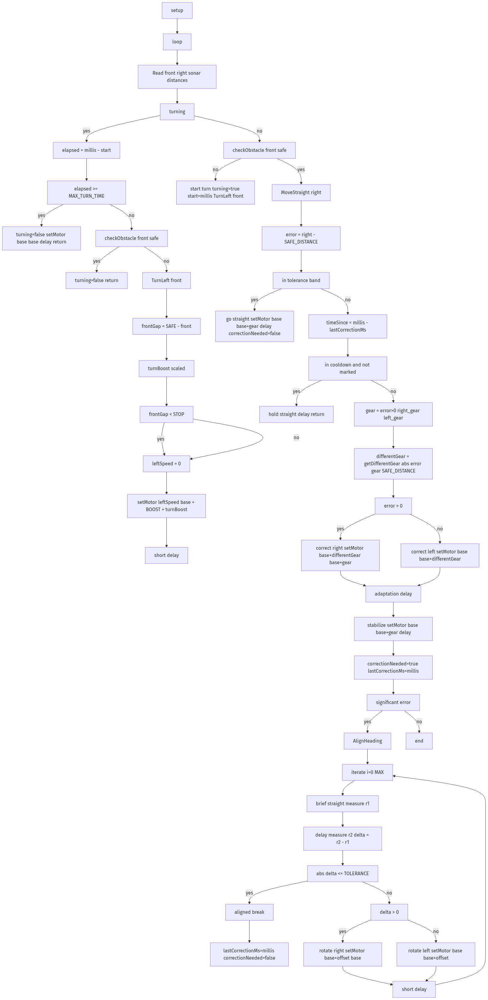

# Task Turning 程序逻辑框图

> 基于 `task_turning/task_turning.ino` 的主流程、避障/转向逻辑、航向对齐与直行修正的分块图。

## 生成的图片



## 主循环（setup/loop/Move）

```mermaid
flowchart TD
  A[setup()] --> B[loop()]
  B --> C[读取前/右声呐距离]
  C --> D{当前是否处于转向(turning)?}
  D -- 是 --> E[elapsed = millis() - start]
  E --> F{elapsed >= MAX_TURN_TIME?}
  F -- 是 --> G[turning=false\nsetMotor(基础,基础)\n延时\n返回]
  F -- 否 --> H{checkObstacle(frontDistance) 前方是否安全?}
  H -- 是 --> I[turning=false\n返回]
  H -- 否 --> J[TurnLeft(frontDistance)\n返回]
  D -- 否 --> K{checkObstacle(frontDistance) 前方是否安全?}
  K -- 否 --> L[开始左转: turning=true\nstart=millis()\nTurnLeft(frontDistance)]
  K -- 是 --> M[MoveStraight(rightDistance)]
```

## 直行修正（MoveStraight）

```mermaid
flowchart TD
  MS1[error = rightDistance - SAFE_DISTANCE]
  MS1 --> MS2{误差在容忍带内?\n(-LEFT_TOLERANT_DISTANCE ≤ error ≤ RIGHT_TOLERANT_DISTANCE)}
  MS2 -- 是 --> MS3[直行保持\nsetMotor(基础, 基础+基准差速)\n延时\ncorrectionNeeded=false]
  MS2 -- 否 --> MS4[timeSince = millis() - lastCorrectionMs]
  MS4 --> MS5{处于冷却期且未标记需修正?}
  MS5 -- 是 --> MS6[保持直行\n延时\n返回]
  MS5 -- 否 --> MS7[选择档位系数\ngear = (error>0? 右直行差速 : 左直行差速)]
  MS7 --> MS8[differentGear = getDifferentGear(|error|, gear, SAFE_DISTANCE)]
  MS8 --> MS9{error > 0? (右侧距离偏大)}
  MS9 -- 是 --> MS10[向右微调\nsetMotor(基础+differentGear, 基础+基准差速)]
  MS9 -- 否 --> MS11[向左微调\nsetMotor(基础, 基础+differentGear)]
  MS10 --> MS12[适配延时]
  MS11 --> MS12
  MS12 --> MS13[稳定保持\nsetMotor(基础, 基础+基准差速)\n延时]
  MS13 --> MS14[correctionNeeded=true\nlastCorrectionMs=millis()]
  MS14 --> MS15{显著误差?\n|error| > LEFT_TOLERANT_DISTANCE + 15}
  MS15 -- 是 --> AH[AlignHeading()]
  MS15 -- 否 --> END[结束本轮]
```

## 左转策略（TurnLeft）

```mermaid
flowchart TD
  TL1[frontGap = FRONT_SAFE_DISTANCE - frontDistance\n(>0 表示前方仍近)]
  TL1 --> TL2[turnBoost 按 frontGap 线性缩放]
  TL2 --> TL3[若 frontGap < FRONT_STOP_DISTANCE\n左轮给少量速度]
  TL3 --> TL4[setMotor(左速, 基础 + TURNING_GEAR_BOOST + turnBoost)]
  TL4 --> TL5[短延时]
```

## 航向对齐（AlignHeading）

```mermaid
flowchart TD
  AH1[迭代至多 HEADING_MAX_ITERATIONS]
  AH1 --> AH2[短暂直行并采样右侧距离 r1]
  AH2 --> AH3[延时后采样 r2\n计算 delta = r2 - r1]
  AH3 --> AH4{|delta| ≤ HEADING_DERIVATIVE_TOLERANCE?}
  AH4 -- 是 --> AH5[认为与岸线平行\n跳出]
  AH4 -- 否 --> AH6{delta > 0?\n右距增加}
  AH6 -- 是 --> AH7[微向右旋\nsetMotor(基础+调整偏移, 基础)]
  AH6 -- 否 --> AH8[微向左旋\nsetMotor(基础, 基础+调整偏移)]
  AH7 --> AH9[短延时]
  AH8 --> AH9[短延时]
  AH9 --> AH1
  AH5 --> AH10[lastCorrectionMs=millis()\ncorrectionNeeded=false]
```

---

### 说明
- 主循环：采集声呐距离并交给 `Move()` 决定是直行修正还是左转避障。
- 转向态：进入左转后，受最大转向时间与前方是否清空控制，满足条件即退出转向态。
- 直行修正：在“容忍带”内保持直行；超出时依据误差方向与大小进行微调，并带冷却与稳定保持；误差显著时调用航向对齐。
- 航向对齐：通过右距的导数判断朝向是否平行于岸线，必要时进行左右微旋校正。
- 声呐读取：使用中值滤波，无效读数超时返回最大距离以提高稳健性。
